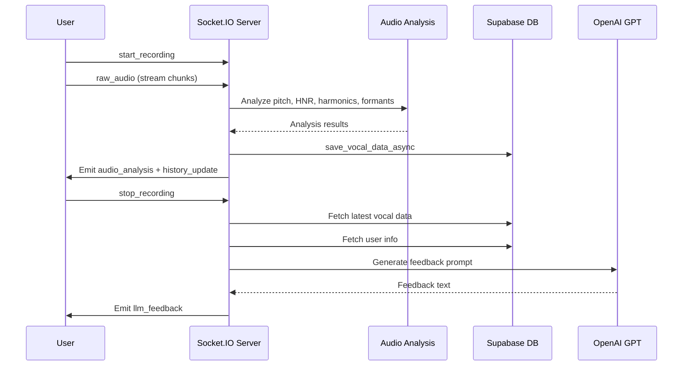
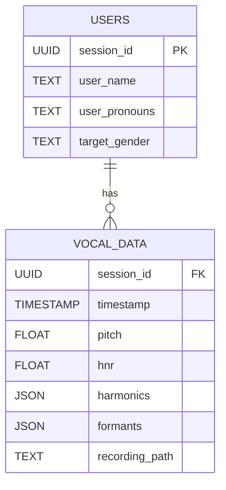

# Vox 0.1.3 - Architecture Overview

---

## High-Level Description

Vox is a Flask + Socket.IO web app designed as a voice therapy coach for trans individuals. It uses asyncpg to connect to a Supabase PostgreSQL database, OpenAI's GPT models for personalized feedback, and real-time audio analysis with `librosa` and `aubio`. It supports user sessions, saving recordings, analyzing voice features, and providing affirming AI chat.

---

## Main Components

### 1. Flask App with Async Endpoints
- `/` (index): initializes user session, fetches or creates user info, serves homepage.
- `/set_target_gender`: saves user's target gender.
- `/set_user_info`: saves user's name and pronouns.
- `/get_performances`: fetches user's past recordings and analysis.
- `/save_recording`: uploads and stores a new voice recording.
- `/clear_history`: deletes all user's recordings and data.
- `/chat`: sends user message to OpenAI for affirming chat.

### 2. Socket.IO Events
- `start_recording` / `stop_recording`: manage recording state, trigger feedback generation.
- `raw_audio`: receives live audio chunks, performs pitch, HNR, harmonics, formants analysis, emits real-time feedback.
- `save_recording`: links saved file path to latest vocal data.

### 3. Database (Supabase PostgreSQL)
- `users` table: session_id, user_name, user_pronouns, target_gender.
- `vocal_data` table: session_id, timestamp, pitch, hnr, harmonics, formants, recording_path.

### 4. Audio Analysis
- **Pitch detection:** aubio's YIN algorithm.
- **HNR:** librosa.
- **Formants:** LPC analysis.
- **Harmonics:** spectral peak extraction.

### 5. AI Feedback
- Uses Google Gemini 2.0 Flash.
- Custom prompt with user's name, pronouns, vocal metrics.
- Generates warm, affirming, personalized feedback.

---

## Diagrams

### Overall System Flow

```mermaid
flowchart TD
    subgraph Client
        A1[User visits site] --> A2[Records voice]
        A2 --> A3[Uploads recording / streams audio]
        A3 --> A4[Receives real-time feedback]
        A4 --> A5[Views past performances]
        A4 --> A6[Chats with AI]
    end

    subgraph Server
        B1[Flask async app]
        B2[Socket.IO server]
        B3[Supabase PostgreSQL]
        B4[OpenAI API]
        B5[Audio Analysis (librosa, aubio)]
    end

    A1 -->|HTTP| B1
    A2 -->|Socket.IO| B2
    A3 -->|Socket.IO| B2
    A4 -->|Socket.IO| B2
    A5 -->|HTTP| B1
    A6 -->|HTTP| B1

    B1 -->|asyncpg| B3
    B2 -->|asyncpg| B3
    B2 --> B5
    B2 -->|OpenAI| B4
    B1 -->|OpenAI| B4
```

---

### Socket.IO Real-Time Feedback Loop



---

### Database Schema (Simplified)



---

*Generated on 2025-04-06*
